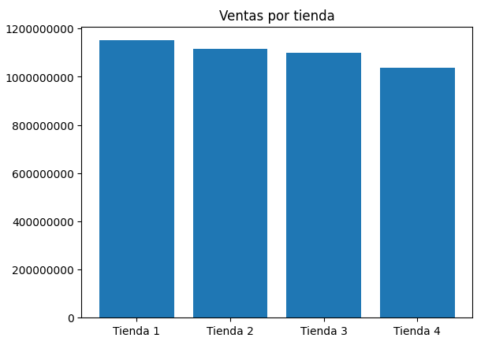
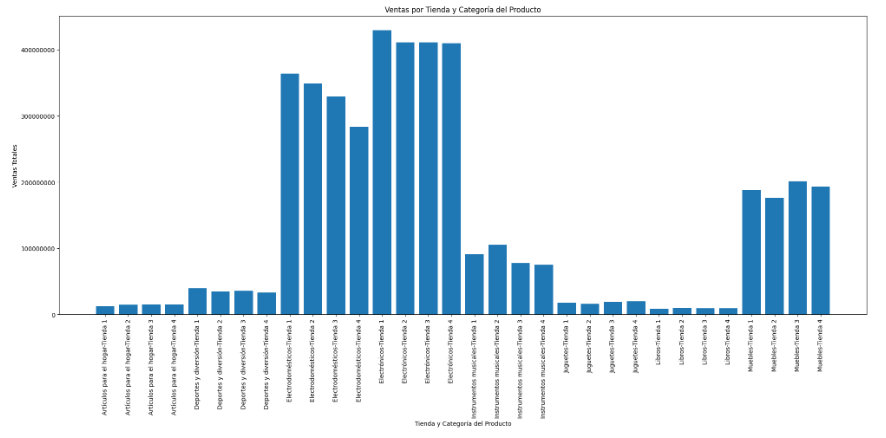
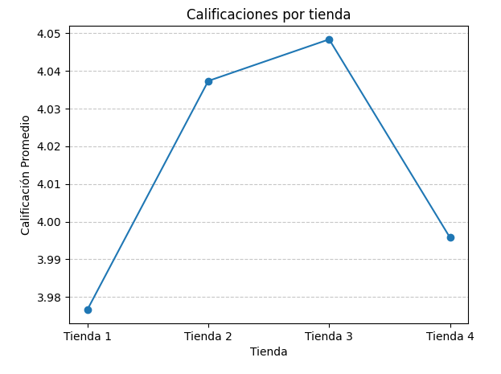
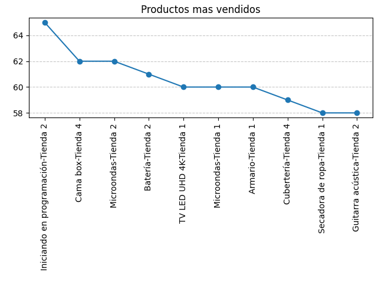

# Proyecto de Análisis de Ventas - Alura Store

## Propósito del Análisis

Este proyecto analiza los datos de ventas de cuatro tiendas de Alura para identificar patrones, tendencias y oportunidades. El objetivo es proporcionar insights sobre el rendimiento de cada tienda para apoyar la toma de decisiones del Señor Juan.

## Estructura y Organización

El proyecto se presenta en un único Google Colab Notebook. Los datos se cargan directamente desde GitHub y el notebook está organizado en secciones que cubren:

*   Importación de datos.
*   Análisis de facturación total por tienda.
*   Ventas por categoría de producto.
*   Calificación promedio de los productos.
*   Identificación de productos más y menos vendidos.
*   Costo de envío promedio por tienda.
*   Análisis de tendencias de ventas anuales.

## Insights Clave y Gráficos (Ejemplos)

*   **Facturación por Tienda**: La `Tienda 1` lidera en facturación, mientras que la `Tienda 4` muestra el menor ingreso total.
    

*   **Ventas por Categoría**: `Electrónicos` es la categoría más vendida consistentemente en todas las tiendas. `Libros` y `Artículos para el hogar` son las de menores ingresos.
    

*   **Calificación Promedio**: La `Tienda 3` tiene la calificación promedio más alta (4.0483), con todas las tiendas superando el 3.9, indicando buena satisfacción.
    

*   **Productos Más y Menos Vendidos**: "Iniciando en programación-Tienda 2" es el más vendido (65 unidades), y "Juego de mesa-Tienda 2" es de los menos vendidos (32 unidades).
    

*   **Envío Promedio**: La `Tienda 1` tiene el costo de envío más alto, y la `Tienda 4` el más bajo.

*   **Ventas Anuales**: Todas las tiendas tuvieron un pico de ventas en 2021, con un descenso general en 2022 y 2023. La `Tienda 4` fue la de menor facturación en 2023.

## Instrucciones para Ejecutar el Notebook

1.  **Abrir en Google Colab**: Acceda al archivo `.ipynb` en Google Colab.
2.  **Ejecutar celdas**: Ejecute las celdas de código secuencialmente o "Ejecutar todo".
3.  **Conexión a Internet**: Necesaria para la descarga de datos desde GitHub.

No se requieren instalaciones adicionales de librerías.
